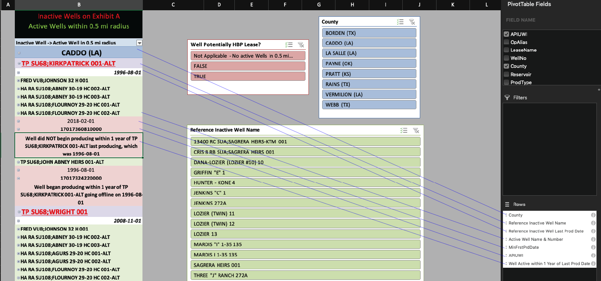

# Project/Notebook Goals

## Assignment:  
* Find active oil/gas wells within a specified radius for a separate list of inactive wells
* The goal is to determine if the active wells have potentially saved the oil & gas lease pertaining to the inactive well
* Provide client with Excel Pivot Table showcasing viable active wells that could've saved and "held lease by production."


# Libraries & Code
1. Python 3.6
2. Geopandas, Pandas, Datetime, Numpy


## Code Overview
1.  Read in geospatial data
    * Reference Wells - Shapefile of Inactive wells for which company wants to find active wells wtihin 0.5 mile radius
    * Active Wells - Shapefile of all active wells in counties corresponding to inactive wells
2. Prep data by converting CRS for each data set and adding buffer radius to inactive wells
3. Geospatially filter active wells within buffer radius for each inactive well
    * During this step, each returned geodataframe will be stored in a list for concatenation
    * Also, select fields of the inactive well will be stored to identify list of active wells back to inactive well
4. Determine if active well could've saved lease for inactive well
    * Find minimum first production date for each active well
        * Wells can have multiple zones, and could contain multiple dates for first production date.  Thus, grouping by each well identifier (API/UWI) is required to ensure we get the earliest date
    * Based on last production date of inactive well, and earliest first production date of active well within radius, determine if they were in within 1 year of each other

### Function Code Snippet

```python

def IswithinOneYear(min_first_prod, last_prod_inactivewell, refwellaname):
    '''
    min_first_prod: earliest first prod date of active well
    last_prod_inactivewell: last prod date of inactive well
    refwellname: name of inactive well
    return: Boolean value of whether well started producing within 1 year or not
    '''

    #try to convert value to datetime - prevents error if there is not string date in row
    try:
        min_first_prod = dt.datetime.strptime(min_first_prod, "%Y-%m-%d")
        last_prod_inactivewell = dt.datetime.strptime(last_prod_inactivewell, "%Y-%m-%d")
    except:
        return "Not Applicable - No active Wells in 0.5 mi radius"


    #subtracting 2 dates to get difference of days
    deltaT = min_first_prod - last_prod_inactivewell

    if deltaT.days <=365:
        return True
    else:
        return False

hbpwells["Well Potentially HBP Lease?"] = hbpwells.apply(lambda x: IswithinOneYear(x['MinFrstPrdDate'], x['Reference Inactive Well Last Prod Date'], x["Reference Inactive Well Name"]), axis = 1)

```


5. Export source table for creating Pivot Table in Excel for visualizing results

Pivot Table Hierarchy


